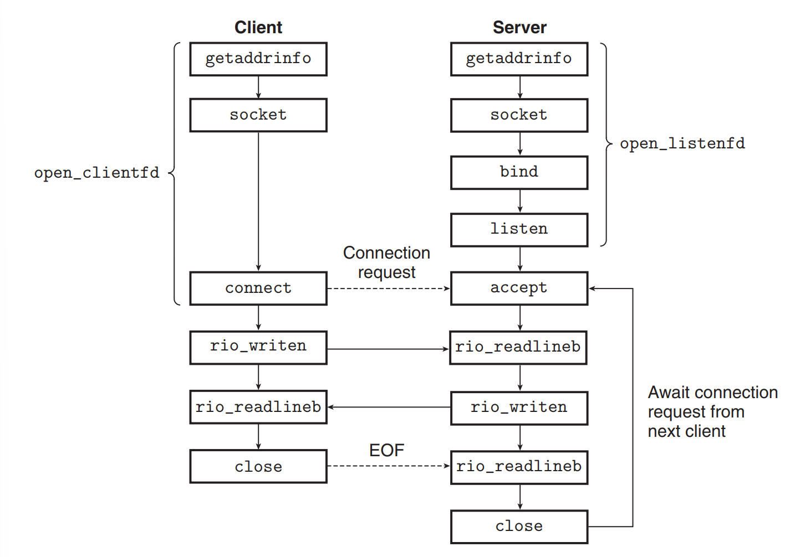

# API:
## The Sockets Interface

---
layout: st-left
image: ./images/ST02A_A020.png
background: ./images/BK035D.png
---

# The Sockets Interface

- The *sockets interface* is a set of functions that are used in conjunction with the Unix
I/O functions to build network applications.
- Thanks to the **file descriptor** abstraction, the sockets interface can be used in conjunction with the *Unix I/O functions* to build network applications.
- In our course, only TCP sockets are used. Thus, we can summarize the sockets interface as in this figure:

---
layout: st-left
background: ./images/BK035D.png
---



---
layout: st-left
background: ./images/BK035D.png
---

# Socket Address Structures

- The socket address structures are used to specify the address of a socket.
- In Linux, there are two useful socket types: the *Internet socket* and the *Unix domain socket*. We only use the Internet socket in this course.

```c
/* IP socket address structure */
struct sockaddr_in {
  uint16_t sin_family; /* Protocol family (always AF_INET) */
  uint16_t sin_port; /* Port number in network byte order */
  struct in_addr sin_addr; /* IP address in network byte order */
  unsigned char sin_zero[8]; /* Pad to sizeof(struct sockaddr) */
};
/* Generic socket address structure (for connect, bind, and accept) */
struct sockaddr {
  uint16_t sa_family; /* Protocol family */
  char sa_data[14]; /* Address data */
};
```

---
layout: st-left
image: ./images/ST02A_C010.png
background: ./images/BK035D.png
---

# The `socket` Function

```c
#include <sys/types.h>
#include <sys/socket.h>
int socket(int domain, int type, int protocol);
// Returns: nonnegative descriptor if OK, −1 on error
int clientfd = socket(AF_INET, SOCK_STREAM, 0);
```

- Clients and servers use the `socket` function to create a *socket descriptor*.
- The `socket` function takes three arguments:
  - `domain`: the communication domain, which is `AF_INET` for Internet sockets.
  - `type`: the socket type, which is `SOCK_STREAM` for TCP sockets.
  - `protocol`: the protocol to use, which is `0` for the default protocol.

---
layout: st-left
image: ./images/ST02A_C010.png
background: ./images/BK035D.png
---

# The `socket` Function

- The `socket` function returns a *socket descriptor* that is used in subsequent calls to the sockets interface.
- After obtaining a socket descriptor, we still need some work to make it useful.

---
layout: st-left
image: ./images/ST02A_C020.png
background: ./images/BK035D.png
---

# The `connect` Function

```c
int connect(int clientfd, const struct sockaddr *addr, socklen_t addrlen);
// Returns: 0 if OK, −1 on error
```

- Blocking
- The `connect` function is used by a client to establish a connection with a server.

---
layout: st-left
image: ./images/ST02A_C020.png
background: ./images/BK035D.png
---

# The `bind` Function

```c
int bind(int sockfd, const struct sockaddr *addr, socklen_t addrlen);
// Returns: 0 if OK, −1 on error
```

- The `bind` function is used by a server to specify the address to which it will bind.

---
layout: st-left
image: ./images/ST02A_D010.png
background: ./images/BK035D.png
---

# The `listen` Function

```c
int listen(int sockfd, int backlog);
// Returns: 0 if OK, −1 on error
```

- The `listen` function converts `sockfd` from an active socket to a *listening socket*
that can accept connection requests from clients.
- We could specify the maximum number of connections that the kernel should queue for this socket.

---
layout: st-left
image: ./images/ST02A_D010.png
background: ./images/BK035D.png
---

# The `accept` Function

```c
int accept(int sockfd, struct sockaddr *addr, socklen_t *addrlen);
// Returns: nonnegative descriptor if OK, −1 on error
```

- Blocking
- The `accept` function is used by a server to accept a connection request from a client.
- As like the `connect` function, the `accept` function returns a new socket descriptor that is used to communicate with the client, and also fills in the client’s socket address structure.

---
layout: full-content
background: ./images/BK035D.png
---

# The `getaddrinfo` Function

```c
int getaddrinfo(const char *host, const char *service, const struct addrinfo *hints, struct addrinfo **result);
// Returns: 0 if OK, nonzero error code on error
void freeaddrinfo(struct addrinfo *result);
// Returns: nothing
const char *gai_strerror(int errcode);
// Returns: error message
```

- The `getaddrinfo` function converts string representations of hostnames, host
addresses, service names, and port numbers into socket address structures.
- It's reentrant (see Section 12.7.2) and works with any protocol.
- The return value is a linked list of `addrinfo` structures, each of which contains a socket address structure.

---
layout: st-left
image: ./images/ST02A_D010.png
background: ./images/BK035D.png
---

# Sockets Helpers

- We could wrap the sockets interface into a set of helper functions to make it easier to use.
- The `Open_clientfd` function is used by a client to establish a connection with a server.
- The `Open_listenfd` function is used by a server to create a listening socket.
