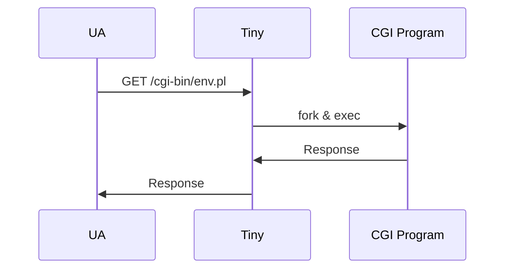

# Demo:
## The Tiny Web Server


---
layout: st-left
background: BK016N.png
---

# Tiny Web Server: Static Content

```c
void serve_static(int fd, char *filename, int filesize) {
  int srcfd;
  char *srcp, filetype[MAXLINE], buf[MAXBUF];
  get_filetype(filename, filetype); 
  sprintf(buf, "HTTP/1.0 200 OK\r\n"); 
  sprintf(buf, "%sServer: Tiny Web Server\r\n", buf);
  sprintf(buf, "%sConnection: close\r\n", buf);
  sprintf(buf, "%sContent-length: %d\r\n", buf, filesize);
  sprintf(buf, "%sContent-type: %s\r\n\r\n", buf, filetype);
  Rio_writen(fd, buf, strlen(buf)); 
  /* Send response body to client */
  srcfd = Open(filename, O_RDONLY, 0); 
  srcp = Mmap(0, filesize, PROT_READ, MAP_PRIVATE, srcfd, 0);
  Close(srcfd); 
  Rio_writen(fd, srcp, filesize); 
  Munmap(srcp, filesize); 
}
```

- Personally, this repeated sprintf is a bit ugly...
- Why using `mmap` rather than `read`?

<!--
- `mmap` is faster than `read` because it doesn't need to copy data from kernel to user space
- `mmap` is also more efficient because it doesn't need to make a system call for each read
-->

---
layout: st-left
image: ST02A_B030.png
background: BK016N.png
---

# Tiny Web Server: Dynamic Content



---
layout: st-left
image: ST02A_C010.png
background: BK016N.png
---

# Tiny Web Server: Dynamic Content

```c
void serve_dynamic(int fd, char *filename, char *cgiargs) {
  char buf[MAXLINE], *emptylist[] = { NULL };
  /* Return first part of HTTP response */
  sprintf(buf, "HTTP/1.0 200 OK\r\n");
  Rio_writen(fd, buf, strlen(buf));
  sprintf(buf, "Server: Tiny Web Server\r\n");
  Rio_writen(fd, buf, strlen(buf));
  if (Fork() == 0) { /* Child */
    /* Real server would set all CGI vars here */
    setenv("QUERY_STRING", cgiargs, 1); 
    Dup2(fd, STDOUT_FILENO); /* Redirect stdout to client */
    Execve(filename, emptylist, environ); /* Run CGI program */
  }
  Wait(NULL); /* Parent waits for and reaps child */
}
```

*Write programs that do one thing and do it well. Write programs to work together. Write programs to handle text streams, because that is a universal interface.*