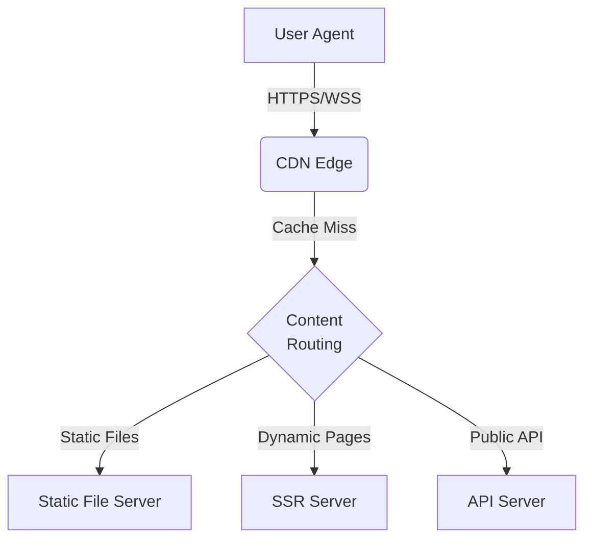
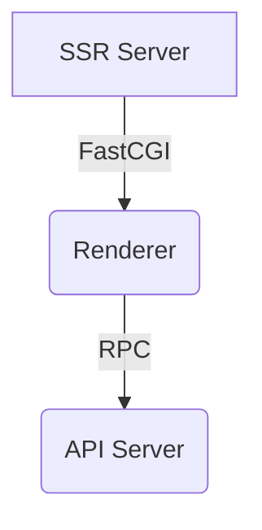

# Idea:
## Serving Dynamic Content

---
layout: st-left
background: BK013D.png
---

# Background
SSR, The classic solution to support a dynamic web

Before Google's SOTA V8 engine, JavaScript was a slow interpreted language. And the Web API of former days was not as powerful as it is today. Thus, the classic solution to create a dynamically interactive web application was to render the HTML strings on the server, and send them to the client. The client would then display the HTML strings. This is the so-called **server-side rendering**.

For example, a common routine for a *user login* is:
1. GET `/`, server return a page with a login form;
2. User enter their credentials and submit the form and POST to `/login`;
3. Server check the credentials, set a cookie, then redirect to `/`;
4. GET `/`, server return a page with the user's data.

---
layout: st-left
background: BK013D.png
---

# Server-Side Rendering (SSR)

- Since HTTP protocol is stateless, we could abstract the SSR application as a function:
- `render(request) -> response`
- We have request's URL, method, headers, body, etc. as input;
- We will output response's status code, headers, body, etc.
- Web frameworks, like JSP, ASP.net, PHP... are all actually SSR frameworks.
- In our course's scope, we'll focus on another technology: **Common Gateway Interface (CGI)**.

---
layout: st-left
image: ST02A_A020.png
background: BK013D.png
---

# Common Gateway Interface (CGI)

> *Write programs that do one thing and do it well. Write programs to work together. Write programs to handle text streams, because that is a universal interface.*
> -- **The Unix Philosophy**

- With CGI, we can turn a unix program into a web application.
- The program will read the request from stdin, and write the response to stdout.
- The program will be executed by the web server, and the web server will read the response from the program's stdout, and send it to the client.
- The web server will also set some environment variables for the program, like `REQUEST_METHOD`, `QUERY_STRING`, `CONTENT_TYPE`, `CONTENT_LENGTH`, etc.
- The program will also read the request's body from stdin, if the request has a body.

---
layout: st-left
image: ST02A_A020.png
background: BK013D.png
---

# CGI: Example

```c
#include "csapp.h"
int main(void) {
  char *buf, *p; char arg1[MAXLINE], arg2[MAXLINE];
  int n1 = 0, n2 = 0;
  if ((buf = getenv("QUERY_STRING")) != NULL) {
    p = strchr(buf, '&'); *p = '\0';
    strcpy(arg1, buf); strcpy(arg2, p+1);
    n1 = atoi(arg1); n2 = atoi(arg2);
  }
  printf("Connection: close\r\n");
  printf("Content-length: %d\r\n", (int)strlen(content));
  printf("Content-type: text/html\r\n\r\n");
  printf("QUERY_STRING=%s", buf);
  printf("Welcome to add.com: ");
  printf("THE Internet addition portal.\r\n<p>");
  printf("The answer is: %d + %d = %d\r\n<p>", n1, n2, n1 + n2);
  printf("Thanks for visiting!\r\n");
  fflush(stdout);
  exit(0);
}
```

---
layout: st-left
image: ST02A_C010.png
background: BK013D.png
---

# CGI: Pros and Cons

- Pros:
  - CGI is a simple interface, and it's easy to implement.
  - CGI is a standard, and it's supported by most web servers.
  - For embedded systems, CGI is a good solution to support dynamic content.
- Cons:
  - Child processes are expensive - performance penalty!
  - Interacting with Linux's low-level APIs - dangerous!
  - Extensibility is limited - hard to support new features.

---
layout: st-left
image: ST02A_C030.png
background: BK013D.png
---

# Modern SSR Architecture

<div class="flex">





</div>